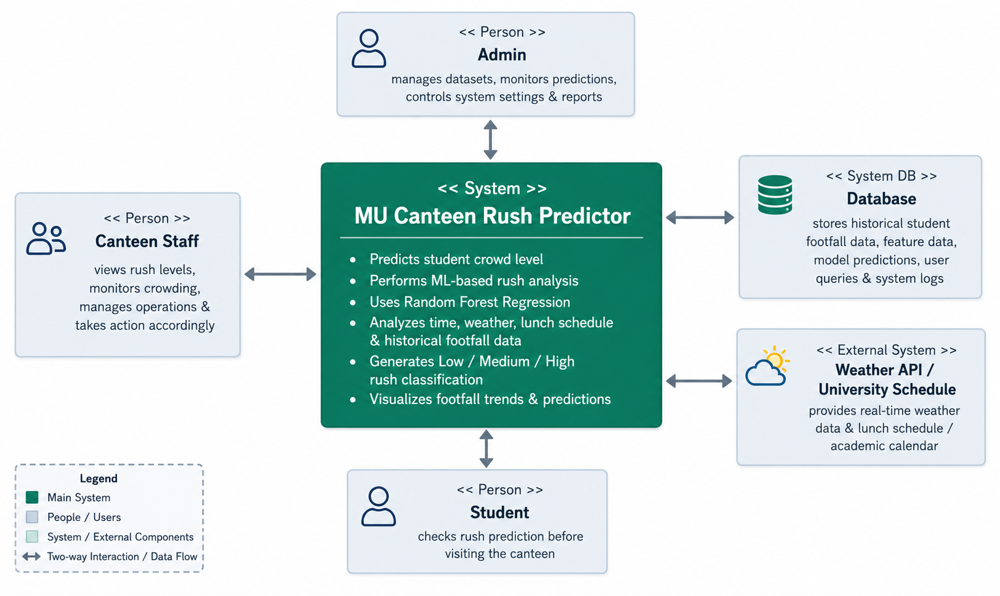

# Software Requirements Specification (SRS)

# Metropolitan University Canteen Rush Predictor

----------

# Preface

This document provides the Software Requirements Specification (SRS) for the **MU Canteen Rush Predictor**. It defines the functional and non-functional requirements, machine learning workflow, system architecture, and operational constraints necessary for the development and deployment of the project.

The system is designed to analyze historical canteen footfall data and predict student crowd intensity using machine learning techniques.

----------

# Version History

- **Version 1.0**: Initial Draft
- **Version 1.1**: Added ML workflow and evaluation metrics
- **Version 1.2**: Added system evolution and deployment considerations


# 1. Introduction

## 1.1 Purpose

The **MU Canteen Rush Predictor** is a machine learning-based analytical system designed to predict the number of students visiting the university canteen and classify the rush intensity into categories such as **Low**, **Medium**, and **High**.

The system uses historical data patterns based on:

-   Time slot
-   Day of the week
-   Weather condition
-   Lunch schedule

The goal is to help canteen administrators improve operational efficiency, optimize food preparation, reduce waiting times, and manage crowd distribution effectively.

----------

## 1.2 Document Conventions

This document follows IEEE SRS documentation standards.

-   **Must** → Indicates mandatory requirements essential for the system, such as dataset preprocessing, machine learning model training, prediction generation, and evaluation metrics.
-   **Should** → Indicates recommended features that improve usability, visualization quality, and analytical performance, such as advanced graphical analysis and enhanced model comparison.
-   **May** → Indicates optional future enhancements, including real-time prediction support, web dashboard integration, mobile application support, and AI-based recommendation features.

----------

## 1.3 Intended Audience and Reading Suggestions

-  **Developers:** Understand implementation requirements
  
-  **Data Scientists:** Understand ML workflow and modeling

-  **Project Supervisors:** Review project objectives and outputs

-  **Testers & QA Teams:** Validate system functionality and accuracy

-  **Researchers:** Analyze predictive modeling approach

----------

## 1.4 Scope

The system provides:

-   Historical canteen data analysis
-   Rush prediction using machine learning
-   Rush level classification
-   Exploratory Data Analysis (EDA)
-   Data visualization dashboards
-   Model evaluation and comparison
-   Predictive analytics for crowd management

----------

## 1.5 References

-   IEEE Standard 830-1998 (Software Requirements Specification)
-   Scikit-learn Documentation
-   Pandas Documentation
-   Seaborn & Matplotlib Documentation
-   MU Canteen Rush Dataset Repository

----------

# 2. Overall Description

## 2.1 Product Perspective

The MU Canteen Rush Predictor is a standalone machine learning application that processes historical student footfall data and generates predictive insights.

The project includes:

-   Data preprocessing pipeline
-   Exploratory data analysis
-   Machine learning model training
-   Performance evaluation
-   Rush classification mechanism
-   Visualization modules

The system may later evolve into a web-based or real-time prediction platform integrated with university systems.

----------

## 2.2 Product Functions

### Data Analysis

-   Inspect and clean canteen dataset
-   Analyze trends in student footfall

### Data Visualization

-   Generate plots and statistical charts
-   Display rush-level distributions
-   Visualize feature relationships

### Machine Learning Prediction

-   Train regression models
-   Predict student counts
-   Compare model performances

### Rush Classification

-   Convert predicted student counts into:
    -   Low Rush
    -   Medium Rush
    -   High Rush

### Reporting

-   Display evaluation metrics:
    -   MAE
    -   MSE
    -   R² Score

----------

## 2.3 User Classes and Characteristics

### Student Researchers

* Analyze canteen footfall data
* Experiment with machine learning models
* Study prediction accuracy and visualization outputs
* Perform research and analytical tasks

---

### Developers

* Maintain and improve the system
* Update machine learning models and features
* Fix bugs and optimize performance
* Manage system integration and deployment

---

### University Administration

* Use prediction results for operational decision-making
* Monitor canteen rush patterns
* Improve crowd and food management
* Optimize resource allocation during peak hours

---

### Data Analysts

* Interpret statistical visualizations and metrics
* Analyze trends and behavioral patterns
* Compare model performance results
* Generate analytical insights from prediction outputs


## 2.4 Operating Environment

-   Programming Language: Python 3.x
-   IDE Support:
    -   Jupyter Notebook
    -   VS Code
    -   PyCharm
-   Operating Systems:
    -   Windows
    -   Linux
    -   macOS
-   Libraries:
    -   pandas
    -   numpy
    -   matplotlib
    -   seaborn
    -   scikit-learn

----------

## 2.5 Design and Implementation Constraints

-   Requires internet connection for dataset loading from GitHub
-   Accuracy depends on dataset quality
-   Prediction reliability may vary with unseen data
-   Limited to historical dataset features

----------

## 2.6 Assumptions and Dependencies

### Assumptions

-   Historical data reflects realistic canteen usage patterns
-   Weather and lunch schedules significantly affect rush levels

### Dependencies

-   Python libraries must be installed
-   Dataset must remain accessible online
-   Machine learning libraries must support regression algorithms

----------

# 3. System Requirements Specification

# 3.1 Functional Requirements

## 3.1.1 Dataset Handling

-   The system must load the dataset from GitHub.
-   The system must inspect dataset structure using:
    -   `.head()`
    -   `.info()`
    -   `.isnull()`
-   The system must verify missing values.

----------

## 3.1.2 Exploratory Data Analysis (EDA)

The system must generate visualizations including:

### Rush Analysis

-   Bar charts of rush levels
-   Pie charts of rush distribution
-   Scatter plots of Time vs Students

### Weather Analysis

-   Box plots for weather conditions
-   Average student count comparison

### Lunch Time Analysis

-   Bar charts for lunch-time impact
-   Pie chart for lunch distribution

### Correlation Analysis

-   Heatmaps for feature correlations
-   Pairplots for multivariate analysis

----------

## 3.1.3 Data Preprocessing

The system must:

-   Encode categorical features
-   Convert rush levels into numeric labels
-   Prepare training and testing datasets

### Encoded Features

Feature

Encoding

Day

Label Encoding

Weather

Label Encoding

Rush_Level

Manual Encoding

----------

## 3.1.4 Feature Selection

The system must use the following input features:

-   Time
-   Lunch_Time
-   Day_Encoded
-   Weather_Encoded

The target variable must be:

-   Students

----------

## 3.1.5 Model Training

The system must train:

### Linear Regression Model

Using:

```
LinearRegression()
```

### Random Forest Regressor

Using:

```
RandomForestRegressor(n_estimators=100)
```

----------

## 3.1.6 Model Evaluation

The system must evaluate models using:

-   Mean Absolute Error (MAE)
-   Mean Squared Error (MSE)
-   R² Score

The system should visualize:

-   Actual vs Predicted values
-   Residual distributions
-   Error histograms

----------

## 3.1.7 Rush Level Prediction

The system must classify rush levels based on predicted student counts.

### Classification Rules

f(x)=Low ,x<20
f(x)=Medium, 20<=x<40
f(x)=High, x>=40

Where:

-   `x` = predicted student count

----------

# 3.2 Non-Functional Requirements

## Performance Requirements

-   The system should process predictions efficiently.
-   Model training should complete within acceptable execution time.
-   Visualization rendering should not significantly delay execution.

----------

## Security Requirements

-   The system should prevent unauthorized dataset modification.
-   Local execution environment should maintain data integrity.

----------

## Usability Requirements

-   The system should provide readable visualizations.
-   Output graphs should include titles, legends, and labels.
-   Code structure should be modular and understandable.

----------

## Reliability Requirements

-   The system must produce consistent predictions for identical inputs.
-   The system should handle invalid or missing data gracefully.

----------

## Maintainability Requirements

-   Code should support modular updates.
-   Additional ML models should be easy to integrate.
-   Visualization modules should be reusable.

----------

## Portability Requirements

-   The system must run across:
    -   Windows
    -   Linux
    -   macOS
-   The project should support execution in cloud notebook environments.

----------

# 4. System Models


## 4.1 Workflow Model

### System Workflow

1.  Load Dataset
2.  Inspect & Clean Data
3.  Perform EDA
4.  Encode Features
5.  Split Dataset
6.  Train ML Models
7.  Evaluate Models
8.  Predict Student Count
9.  Classify Rush Level
10.  Display Visualizations

----------

## 4.2 Data Flow Overview

### Inputs

-   Time
-   Day
-   Weather
-   Lunch_Time

### Processing

-   Encoding
-   Regression Modeling
-   Prediction

### Outputs

-   Predicted Student Count
-   Rush Level Classification
-   Evaluation Metrics
-   Statistical Visualizations

----------

## 4.3 Machine Learning Pipeline

### Training Pipeline

```
Dataset → Preprocessing → Feature Selection →Train-Test Split → Model Training →Prediction → Evaluation → Rush Classification
```

----------

# 5. System Evolution

## 5.1 Assumptions

-   Student movement patterns remain relatively stable.
-   Weather continues to influence canteen traffic.

----------

## 5.2 Expected Future Enhancements

### Real-Time Prediction

-   Integration with live university attendance systems

### Web Dashboard

-   Interactive visualization dashboard

### Mobile Support

-   Android/iOS application support

### AI Enhancements

-   Deep learning-based prediction models
-   Adaptive learning from new data

### Additional Features

-   Food demand forecasting
-   Queue waiting time prediction
-   Peak hour optimization recommendations

----------

## 6. Appendices

### 6.1 Hardware Requirements

-   **RAM:** Minimum 4 GB
    
-   **Processor:** Intel i3 or equivalent
    
-   **Storage:** Minimum 500 MB free space
    

----------

### 6.2 Software Requirements

-   **Python 3.x** → Programming language
    
-   **pandas** → Data manipulation
    
-   **numpy** → Numerical operations
    
-   **matplotlib** → Plotting and graph visualization
    
-   **seaborn** → Statistical visualization
    
-   **scikit-learn** → Machine learning model training and evaluation
    

----------

### 6.3 Dataset Requirements

The dataset must contain the following fields:

-   **Time** → Time slot of canteen visit
    
-   **Day** → Day of the week
    
-   **Weather** → Weather condition
    
-   **Lunch_Time** → Lunch schedule indicator
    
-   **Students** → Student footfall count
    
-   **Rush_Level** → Rush category (Low / Medium / High)
    

----------

# 7. Results Summary

### Model Evaluation Results

-   **Linear Regression**
    
    -   MAE: 13.91
        
    -   MSE: 292.24
        
    -   R² Score: 0.52
        
-   **Random Forest Regressor**
    
    -   MAE: 5.00
        
    -   MSE: 41.55
        
    -   R² Score: 0.93
        

----------

### Best Performing Model

-   Random Forest Regressor
    

### Most Influential Features

-   Time Slot
    
-   Lunch_Time

### Best Performing Model

-   Random Forest Regressor

### Most Influential Features

-   Time Slot
-   Lunch_Time

----------

# 8. Conclusion

The **MU Canteen Rush Predictor** demonstrates a complete end-to-end machine learning workflow for predicting institutional crowd behavior.

The project successfully:

-   Analyzes historical canteen footfall patterns
-   Predicts student crowd size
-   Classifies rush intensity levels
-   Compares machine learning model performance
-   Produces meaningful visual insights for operational decision-making
